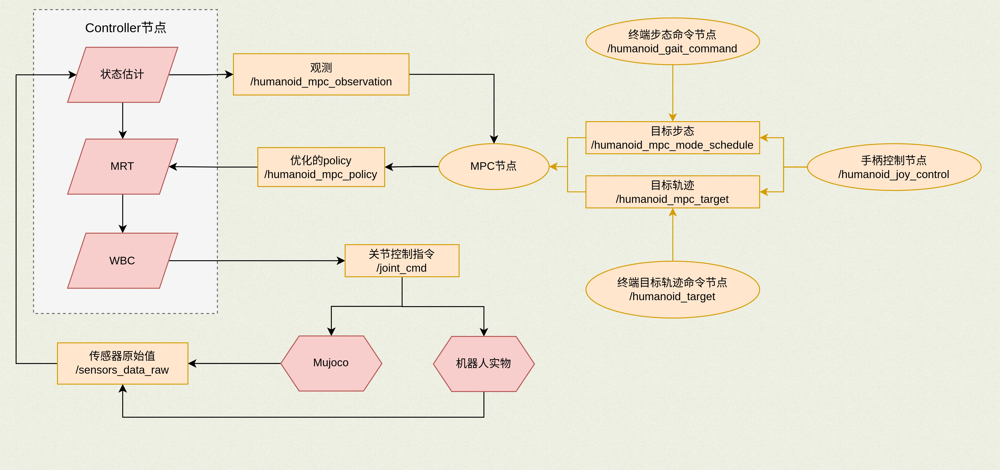

# 1. 通信流程图

# 2. mpc的x和u
## 2.1 OCS2中状态向量顺序
也即话题`/humanoid_mpc_observation`里的state

| idx   | content         |
| ----- | --------------- |
| 0     | `vcom_x`        |
| 1     | vcom_y          |
| 2     | vcom_z          |
| 3     | L_x / robotMass |
| 4     | L_y / robotMass |
| 5     | L_z / robotMass |
| 6     | `p_base_x`      |
| 7     | p_base_y        |
| 8     | p_base_z        |
| 9     | theta_base_z    |
| 10    | theta_base_y    |
| 11    | theta_base_x    |
| 12:na | 关节角度            |

## 2.2 OCS2中控制向量顺序
也即话题`/humanoid_mpc_observation`里的input, 顺序如下：

| idx   | content       |
| ----- | ------------- |
| 0:3   | ll_heel_force |
| 3:3   | ll_toe_force  |
| 6:3   | lr_heel_force |
| 9:3   | lr_toe_force  |
| 12:3  | rl_heel_force |
| 15:3  | rl_toe_force  |
| 18:3  | rr_heel_force |
| 21:3  | rr_toe_force  |
| 24:na | 关节速度          |
# 3. 话题说明
## /humanoid/**
用于可视化的话题,可以忽略

## /humanoid_controller/**
控制器相关的话题,主要有:

`/humanoid_controller/com/r`:质心位置

`/humanoid_controller/com/r_des`:质心期望位置

`/humanoid_controller/com/rd`:质心速度

`/humanoid_controller/com/rd_des`:质心期望速度

`/humanoid_controller/optimizedState_mrt/com/angular_vel_xyz`:从mpc(mrt)取得的质心线速度,顺序为xyz

`/humanoid_controller/optimizedState_mrt/com/angular_zyx`:从mpc(mrt)取得的质心角速度,顺序为zyx

`/humanoid_controller/optimizedState_mrt/base/linear_vel_xyz`:从mpc(mrt)取得的躯干线速度

`/humanoid_controller/optimizedState_mrt/base/pos_xyz`:从mpc(mrt)取得的躯干位置

`/humanoid_controller/optimizedState_mrt/joint_pos:`从mpc(mrt)取得的关节位置

`/humanoid_controller/optimizedInput_mrt/force_*`:从mpc(mrt)取得的第x个接触点的接触力

`/humanoid_controller/optimizedInput_mrt/joint_vel:`从mpc(mrt)取得的关节期望速度

`/humanoid_controller/optimized_mode:` mpc给出的mode

`/humanoid_controller/swing_leg`

`/humanoid_controller/wbc_planned_body_acc/angular`:wbc优化后的躯干角加速度

`/humanoid_controller/wbc_planned_body_acc/linear`:wbc优化后的躯干线性加速度

`/humanoid_controller/wbc_planned_contact_force/left_foot`:wbc优化后的左脚所有接触点的接触力

`/humanoid_controller/wbc_planned_contact_force/right_foot`:wbc优化后的右脚所有接触点的接触力

`/humanoid_controller/wbc_planned_joint_acc`:wbc优化后的关节加速度
## /humanoid_mpc_**
ocs2源码中mpc交互的相关话题.

`/humanoid_mpc_gait_time_name`: 步态的时间和名字

`/humanoid_mpc_mode_scale`:步态的缩放比例,用于控制步频

`/humanoid_mpc_mode_schedule`:步态序列

`/humanoid_mpc_observation`:观测,mpc端接收

`/humanoid_mpc_policy`:mpc计算的结果

`/humanoid_mpc_target`:发送给mpc的期望状态

## /joint_cmd
用于控制机器人

- `control_modes`: 每一个关节对应的控制模式
- `header`:时间戳等信息
- `joint_q`:关节角
- `joint_v`:关节速度
- `tau`:关节扭矩
- `tau_max`:最大关节扭矩
- `tau_ratio`:扭矩系数
## /monitor
监控mpc,wbc等模块的频率(Hz)与耗时(ms)

## /sensor_data_raw
实物机器人, 仿真器发布的传感器原始数据

## /state_estimate
`/state_estimate/end_effector/contact_point_*/feet_height:`第x个接触点的"足端高度"

`/state_estimate/end_effector/contact_point_*/pos:`第x个接触点的位置

`/state_estimate/end_effector/contact_point_*/vel:`第x个接触点的速度

`/state_estimate/mode:`估计的步态mode

`/state_estimate/base/linear_vel:`估计的躯干线速度,顺序为xyz

`/state_estimate/base/pos_xyz:`估计的躯干位置,顺序为xyz

`/state_estimate/base/angular_vel_zyx:`估计的角速度,顺序为zyx

`/state_estimate/base/angular_zyx:`估计的欧拉角,顺序为zyx(ypr)

`/state_estimate/joint/pos:`估计的关节位置

`/state_estimate/joint/vel:`估计的关节速度

## /tf
tf树

## /odom
用于可视化,无需关注
## /pose
由状态估计器发布,无需关注

