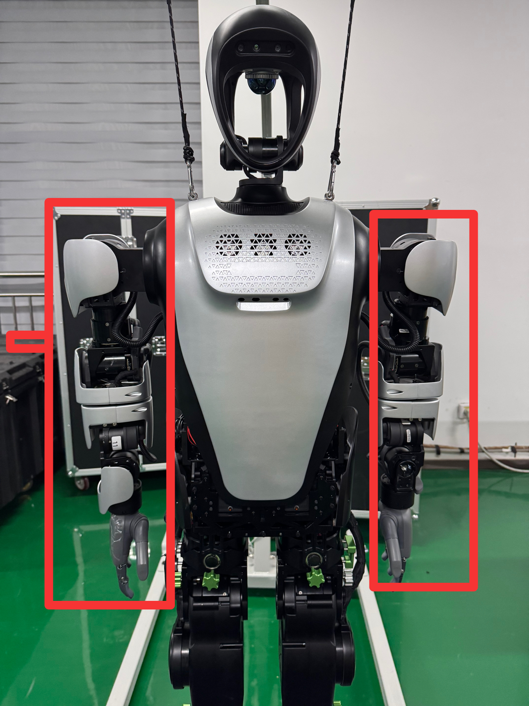

# KUAVO 软件出厂文档


## 概述

文档用于描述 KUAVO 出厂时软件部分需要完成的工作。

### 型号支持

| 型号 | 支持情况 |
| ---- | ---- |
| KUAVO 4.0 | 支持 |
| KUAVO 4.2 pro | 支持 |

## 硬件检查清单

- [ ] 1. NUC 镜像烧录完成
- [ ] 2. 电机安装完成
- [ ] 3. 末端执行器安装完成
- [ ] 4. IMU 传感器安装完成
- [ ] 5. H12PRO 遥控器对频完成（可选）
- [ ] 6. QUEST 3 设备已经安装了 KUAVO_HAND_TRACK APP

## 详细操作步骤

### IMU 配置

1. 使用显示器连接 NUC 后，打开 MT manager 配置 IMU  传感器

```bash
cd ~/mtmanager/linux-x64/bin
sudo ./mtmanager
```

2. 扫描 IMU 设备，如下图


3. 配置 IMU，加速度为2000Hz，角速度为1600Hz，四元数为400Hz，如下图


4. 配置波特率为2M，如下图


5. 点击`Apply`

### 配置PIP CONFIG

新建终端

```bash
pip config set global.index-url https://pypi.tuna.tsinghua.edu.cn/simple
pip config set global.trusted-host pypi.tuna.tsinghua.edu.cn
pip config set install.trusted-host pypi.tuna.tsinghua.edu.cn
```
### 机器人程序准备

1. 拉取代码
新建终端
```bash
cd ~
git clone https://gitee.com/leju-robot/kuavo-ros-opensource.git --branch dev
cd kuavo-ros-opensource
git reset --hard 5698976c89af62e884eac8ad76ad6d38473a2060 #切到指定提交 2024-11-29
```

新建终端
```bash
cd ~ 
sudo rm -rf kuavo_opensource && git clone https://gitee.com/leju-robot/kuavo_opensource.git --branch master --depth 1
```

2. 确认机器人版本号

新建终端

例如机器人版本号为 4.2pro

```bash
echo 'export ROBOT_VERSION=42' >> ~/.bashrc # 设置机器人版本号
sudo su
echo 'export ROBOT_VERSION=42' >> ~/.bashrc # 设置机器人版本号到root用户
```

3. 设置机器人重量(如果机器人重量有修改，需要重新执行一次)

新建终端，分别两次复制执行

```bash
rm -rf ~/.config/lejuconfig/TotalMassV${ROBOT_VERSION} # 删除旧的重量文件
read -p "请输入机器人重量(kg): " robot_mass  # 询问用户输入重量
```

```bash
echo $robot_mass > ~/.config/lejuconfig/TotalMassV${ROBOT_VERSION}  # 设置新的重量
echo "已将机器人重量设置为 ${robot_mass}kg"
```

4. 设置机器人驱动板类型

- 使用 VSCODE 连接机器人
- 打开文件 `~/.config/lejuconfig/EcMasterType.ini` （如果文件不存在，则新建）
- 如果类型为 `elmo`，则设置为 `elmo`，如果类型为优达，则设置为 `youda`

5. 编译
新建终端
```bash
cd ~/kuavo-ros-opensource
sudo su
catkin config -DCMAKE_ASM_COMPILER=/usr/bin/as -DCMAKE_BUILD_TYPE=Release
source installed/setup.bash
catkin build humanoid_controllers
```

### 配置手臂电机配置文件

修改 `~/.config/lejuconfig/config.yaml` 文件中的 `negtive_address` 参数，如下所示

```yaml
negtive_address:
 - [0x0D, 0x02, 0x04, 0x08, 0x0A, 0x0B, 0x09]
```

### 配置灵巧手

新建终端
```bash
cd ~/kuavo_opensource/tools/check_tool
python3 Hardware_tool.py 
```

输入 `b` 加回车 配置灵巧手 usb udev 规则

输入 `c` 加回车 测试灵巧手(如果没反应，需要重启 NUC 使得 udev 规则生效)

### 电机运动方向确认

⚠️ 所有电机运动均符合**右手定则**(右手握住参考物体，大拇指指向参考轴正方向，四指弯曲的方向表示旋转或环绕方向。)

0秒开始时腿部电机**正向运动**示意

31秒开始手臂电机**正向运动**示意

58秒开始头部电机**正向运动**示意

[kuaov_关节正方向运动_说明](https://www.bilibili.com/video/BV1AXzRYeERe/?share_source=copy_web&vd_source=2d815abfceff1874dd081e6eb77cc262)

### 零点校准

1. 请将工装插入机器人腿部, 如下图所示


2. 请将机器人手臂摆好，如下图所示



3. 启动机器人校准程序
新建终端
```bash
cd ~/kuavo-ros-opensource
sudo su
source devel/setup.bash
roslaunch humanoid_controllers load_kuavo_real.launch cali:=true cali_leg:=true cali_arm:=true
```

如果只需要校准手臂，则使用以下命令
新建终端
```bash
cd ~/kuavo-ros-opensource
sudo su
source devel/setup.bash
roslaunch humanoid_controllers load_kuavo_real.launch cali:=true cali_arm:=true
```

4. 在使能完腿部电机后(打印出如下图的位置之后), 零点校准之前电机运动可能会超出限位(如果没超出限位， 则按 `c` 加回车，保存腿部当前位置作为零点)

```bash
0000003041: Slave 1 actual position 9.6946716,Encoder 63535.0000000
0000003051: Rated current 39.6000000
0000003061: Slave 2 actual position 3.9207458,Encoder 14275.0000000
0000003071: Rated current 11.7900000
0000003081: Slave 3 actual position 12.5216674,Encoder 45590.0000000
0000003091: Rated current 42.4300000
0000003101: Slave 4 actual position -37.2605896,Encoder -244191.0000000
0000003111: Rated current 42.4300000
0000003121: Slave 5 actual position 15.8138275,Encoder 207275.0000000
0000003131: Rated current 8.4900000
0000003142: Slave 6 actual position -2.7354431,Encoder -35854.0000000
0000003151: Rated current 8.4900000
0000003161: Slave 7 actual position 5.8642578,Encoder 38432.0000000
0000003171: Rated current 39.6000000
0000003183: Slave 8 actual position -16.8491821,Encoder -61346.0000000
0000003192: Rated current 11.7900000
0000003201: Slave 9 actual position -18.9975585,Encoder -69168.0000000
0000003211: Rated current 42.4300000
0000003221: Slave 10 actual position -64.5283508,Encoder -422893.0000000
0000003231: Rated current 42.4300000
0000003241: Slave 11 actual position -31.0607147,Encoder -407119.0000000
0000003251: Rated current 8.4900000
0000003261: Slave 12 actual position 49.7427368,Encoder 651988.0000000
0000003272: Rated current 8.4900000
0000003281: Slave 13 actual position 26.8544311,Encoder 97774.0000000
0000003291: Rated current 14.9900000
0000003301: Slave 14 actual position -19.9171142,Encoder -72516.0000000
0000003311: Rated current 14.9900000
```

5. 将所有的 `Slave xx actual position ` 后的数字值记录到 `~/.config/lejuconfig/offset.csv` 文件中

⚠️ 注意：

- 如果机器人行走偏左，增大 `offset.csv` 文件中 1 号的值，每次修改幅度为0.5
- 如果机器人行走偏右，减少 `offset.csv` 文件中 7 号的值，每次修改幅度为0.5
- 如果机器人行走重心很低，请重新确认机器人质量后，重新执行设置机器人质量步骤

### 行走测试

1. 启动机器人程序
新建终端
```bash
cd ~/kuavo-ros-opensource
sudo su
source devel/setup.bash
roslaunch humanoid_controllers load_kuavo_real.launch
```


**步态切换**（字母键）
| 按键 | 功能 |
| ---- | ---- |
| A | 站立模式 (STANCE) |
| Y | 行走模式 (WALK) |

**运动控制**（摇杆）
- 左摇杆：控制移动方向
  - 上下：前进/后退
  - 左右：平移
- 右摇杆：
  - 左右：原地转向
  - 上下：调整机器人高度

**功能按键**
- START：从悬挂状态切换到站立状态
- BACK：安全退出程序

### H12PRO 遥控器程序准备（如果需要）

请确认 H12PRO 遥控器已经对频完成

1. 安装 H12PRO 遥控器程序

新建终端

```bash
cd ~/kuavo-ros-opensource/src/humanoid-control/h12pro_controller_node/scripts
sudo su
./deploy_autostart.sh
```

执行中最后会提示三个问题， 分别是:

- 是否开启开机自启动 h12pro 遥控器控制机器人程序
- 是否开启 h12pro 遥控器控制机器人程序
- 是否重启机器人 NUC 使得配置生效

根据需求选择 y 或 n。

2. 检查遥控器数据

新建终端

```bash
cd ~/kuavo-ros-opensource
source devel/setup.bash
rostopic echo /h12pro_channel
```

拨动摇杆或者按下按键，查看数据有变化

⚠️ 此步需要启动 h12pro 遥控器控制机器人程序

3. 开关 H12PRO 遥控器

开启服务：

```bash
sudo systemctl start ocs2_h12pro_monitor.service
```

关闭服务：

```bash
sudo systemctl stop ocs2_h12pro_monitor.service
```

开机自启动：

```bash
sudo systemctl enable ocs2_h12pro_monitor.service
```

关闭开机自启动：

```bash
sudo systemctl disable ocs2_h12pro_monitor.service
```

查看服务日志：

```bash
sudo journalctl -u ocs2_h12pro_monitor.service -f
```


4. 测试 H12PRO 遥控器

基本使用：

| 操作 | 按键说明 |
| ---- | ---- |
| 开机 | E_左 + F_右 + C |
| 校准(校准完只能结束) | E_左 + F_右 + D |

缩腿到站立：

| 操作 | 按键说明 |
| ---- | ---- |
| 缩腿到站立 | E_左 + F_右 + C |

站立阶段：

| 操作 | 按键说明 |
| ---- | ---- |
| 原地踏步 | E_中 + F_中 + A |
| 回到站立 | E_左 + F_右 + D |

左摇杆：

| 操作 | 按键说明 |
| ---- | ---- |
| 垂直方向 | X轴移动 |
| 水平方向 | Y轴移动 |

右摇杆：

| 操作 | 按键说明 |
| ---- | ---- |
| 垂直方向 | 躯干高度控制 |
| 水平方向 | 旋转控制 |

结束程序：长按 C + D(假如在站立状态下触发停止，机器人会先下蹲再停止)

### VR 遥操作测试

请确保 QUEST 3 设备与机器人在同一个局域网下，并且已经安装了 KUAVO_HAND_TRACK APP


1. 安装依赖（只需执行一次）
新建终端
```bash
cd ~/kuavo-ros-opensource
pip3 install -r src/manipulation_nodes/noitom_hi5_hand_udp_python/requirements.txt
sudo su
pip3 install -r src/manipulation_nodes/noitom_hi5_hand_udp_python/requirements.txt
```

2. 启动程序

新建终端

```bash
cd ~/kuavo-ros-opensource
sudo su
source devel/setup.bash
roslaunch humanoid_controllers load_kuavo_real_with_vr.launch
```

⚠️ 启动注意事项：

- 等待机器人腿部缩起
- 将机器人放至离地 2cm 处
- 需一人扶住机器人背部
- 等待 10 秒让程序完全启动

4. 打开 QUEST 3 中的 KUAVO_HAND_TRACK 应用
5. 用户位置标定：
   - 站立，双手握住手柄，放在双腿两侧（模仿机器人站立姿态）
   - 长按右手柄 meta 按钮，等待圆圈转完
6. 机器人站立
   - 如果机器人双腿已经缩起
   - 按下右手柄 A 键，进入站立状态(需用力扶住机器人背部)

7. 控制方式

**基础控制：**

- 右手柄 A 键：**站立状态**
- 右手柄 B 键：返回**行走状态**（原地踏步）
- 机器人头部：自动跟随您的头部运动
- 扳机控制手指开合，Y键用于锁定或解锁手指控制

**移动控制：**

- 左摇杆：前后移动、左右平移
- 右摇杆：调整高度、左右转向

**手臂控制：**

- 长按双手柄扳机：进入**手臂外部控制**
- 移动手柄即可控制机器人手臂运动
- 左 X + 右 A：切换自动摆手/手臂外部控制
- 左 X + 右 B：保持当前姿态

**结束控制：**

- 同时按下双手柄 XY 键（建议先使用右手柄降低机器人高度后结束）

### 导出机器人 LOG

1. 导出终端日志

- 使用 VSCODE 连接机器人
- 连接后打开文件夹 `~/.ros/stdout`, 如下图

- 选择对应的日期目录，下载日志，如下图


2. 导出 ROSBAG 日志

- 使用 VSCODE 连接机器人
- 连接后打开文件夹 `~/.ros`, 如下图

- 选择对应的日期 ROSBAG 文件，下载日志(文件结尾以 `.bag` 或者 `.bag.active` 结尾)，如下图


### 删除闭源代码

执行以下代码：
新建终端
```bash
find ~ -type d -name "*kuavo*" | while read -r dir; do if [ -d "$dir/.git" ]; then REMOTE_URL=$(git -C "$dir" remote get-url origin 2>/dev/null); if [[ "$REMOTE_URL" == "ssh://git@www.lejuhub.com:10026/highlydynamic/kuavo.git" || "$REMOTE_URL" == "https://www.lejuhub.com/highlydynamic/kuavo.git" || "$REMOTE_URL" == "ssh://git@www.lejuhub.com:10026/highlydynamic/kuavo-ros-control.git" || "$REMOTE_URL" == "https://www.lejuhub.com/highlydynamic/kuavo-ros-control.git" ]]; then echo "删除匹配目录：$dir"; sudo rm -rf "$dir"; fi; fi; done
```
