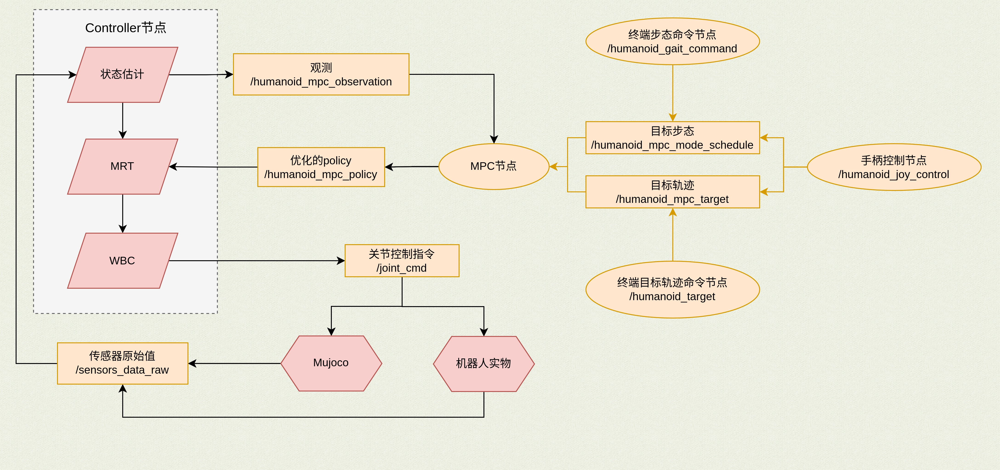
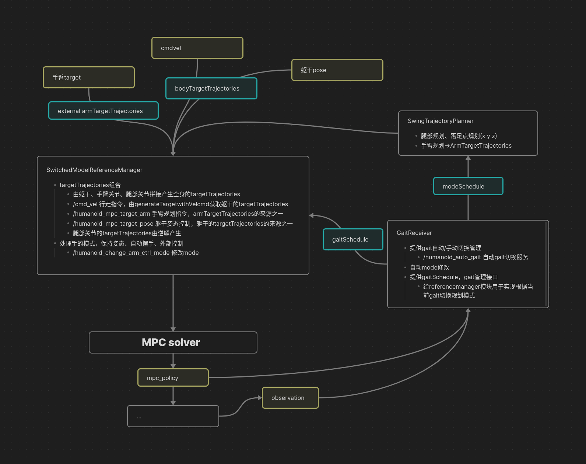

# 运动控制API

节点的含义参考:[topics定义](./readme.topics.md)

- 控制流程图：
  

- MPC节点处理目标轨迹的流程

## 主要topics和srv
### srv
- `/humanoid_change_arm_ctrl_mode` <kuavo_msgs::changeArmCtrlMode>
  - 修改手臂控制模式，control_mode 有三种模式
    - 0: keep pose 保持姿势 
    - 1: auto_swing_arm 行走时自动摆手，切换到该模式会自动运动到摆手姿态
    - 2: external_control 外部控制，手臂的运动由外部控制
- `/humanoid_get_arm_ctrl_mode` <kuavo_msgs::changeGaitMode>
  - 获取当前控制模式，返回 control_mode
- `/humanoid_auto_gait`
  - 是否自动切换gait，默认true，收到非零的 `/cmd_vel` 会自动切换到walk模式，收到全0的 `/cmd_vel` 会自动切换到stance模式。
  - 手动模式下，需要先发布 `/humanoid_mpc_mode_schedule` 才能切换gait模式
- `/humanoid_single_step_control` <kuavo_msgs::singleStepControl>
  - 单步控制，通过给出时间序列和对应的躯干位姿，可以控制机器人的单步行走
  - 时间序列和躯干位姿序列长度必须一致，时间序列需要不断递增
  - 每次服务请求的躯干位姿都是基于局部坐标系，但是一次服务请求中的躯干位姿序列需要以第一个位姿为基准不断变化
- `/gesture/list`
  - 列出所有预设的手势
  - 示例代码: [list_all_gestures.py](../src/demo/gesture/list_all_gestures.py)

  
<b> 点击展开查看所有手势列表, 注意:如与服务接口返回不一致, 请以实际情况为准!</b>

  <table>
    <tr><th>名称</th><th>名称</th><th>别名</th><th>描述</th></tr>
    <tr><td>单指点（内收式）</td><td>"finger-pointing-opposed"</td><td>"number_1"</td><td>用于触动按钮开关、点击键盘、鼠标、指示方向。该手势也可用于表示数字“1”</td></tr>
    <tr><td>单指点（外展式）</td><td>"finger_pointing-unopposed"</td><td>"number_8"</td><td>用于触动按钮开关，表示数字“8”。</td></tr>
    <tr><td>两指夹（内收式）</td><td>"two-finger-spread-opposed"</td><td>"number_2", "victory"</td><td>用于夹持条状物体，如香烟，也可表示“胜利”、数字“2”。</td></tr>
    <tr><td>两指夹（外展式）</td><td>"two-finger-spread-unopposed"</td><td>"hold-cigarette"</td><td>用于夹持条状物体，如香烟。</td></tr>
    <tr><td>两指捏（外展式）</td><td>"precision-pinch-unopposed"</td><td>"ok","number_3"</td><td>用于捏取尺寸、重量较小的物体，表示“OK”。</td></tr>
    <tr><td>两指捏（内收式）</td><td>"precision-pinch-opposed"</td><td></td><td>用于捏取尺寸、重量较小的物体，如硬币、卡片、钥匙、固体胶、花生、葡萄。</td></tr>
    <tr><td>鼠标手势</td><td>"mouse-control"</td><td></td><td>用于控制鼠标，选定该手势以后，仿生手形成对鼠标的包络。</td></tr>
    <tr><td>兔指</td><td>"rock-and-roll"</td><td></td><td>用于彰显个性。</td></tr>
    <tr><td>三指捏（外展式）</td><td>"tripod-pinch-unpposed"</td><td></td><td>用于捏取尺寸中等或是盘状的物体，如手机，瓶盖，固体胶等。</td></tr>
    <tr><td>三指捏（内收式）</td><td>"tripod-pinch-opposed"</td><td>"number_7"</td><td>捏取物体，表示手势数字七。</td></tr>
    <tr><td>食指弹</td><td>"flick-index-finger"</td><td></td><td>用于利用电机和扭簧配合弹出食指。</td></tr>
    <tr><td>中指弹</td><td>"flick-middle-finger"</td><td></td><td>用于利用电机和扭簧配合弹出中指。</td></tr>
    <tr><td>托夹式（大拇指内收）</td><td>"inward-thumb"</td><td>"number_4"</td><td>多用于托碗、盘子等。表示手势数字四。</td></tr>
    <tr><td>四指拿</td><td>"four-finger-straight"</td><td></td><td>用于端取碗或大直径的圆柱物体，物体不接触手心。</td></tr>
    <tr><td>五指张开</td><td>"palm-open"</td><td>"number_5"</td><td>用于平托物体，表示手势数字五。</td></tr>
    <tr><td>握拳</td><td>"fist"</td><td></td><td>握持各类不同大小、形状的物体，如水杯、网球、球拍、苹果。</td></tr>
    <tr><td>虎克提</td><td>"thumbs-up"</td><td>"thumbs-up"</td><td>用于提取物体，如手提袋、包等。同时表达：真棒！点个赞！</td></tr>
    <tr><td>侧边捏</td><td>"side-pinch"</td><td></td><td>用于拿接名片、捏物品等。</td></tr>
    <tr><td>夹笔1</td><td>"pen-grip1"</td><td></td><td>用于夹普通笔、毛笔等写字。</td></tr>
    <tr><td>夹笔2</td><td>"pen-grip2"</td><td></td><td>用于夹普通笔、毛笔等写字。</td></tr>
    <tr><td>五指抓</td><td>"cylindrical-grip"</td><td>"five-finger-grab"</td><td>用于抓取物体，手心不完全接触物体。</td></tr>
    <tr><td>666</td><td>"shaka-sign"</td><td>"number_6", "666"</td><td>表示数字六，同时也是网路用语666。</td></tr>
    <tr><td>五指捏</td><td>"five-finger-pinch"</td><td></td><td>用于抓握物体。</td></tr>
    <tr><td>两指侧捏</td><td>"two-finger-side-pinch"</td><td>"pen-grip3"</td><td>利用食指侧边配合大拇指完成物品捏取。</td></tr>
  </table>

- `/gesture/execute`
  - 该服务用于**抢占式**执行预设的手势(假如有手势正在执行则会中断该执行)，通过 gesture_names 来选择手势，手势名称可以通过 `/gesture/list` 查看
  - **警告:不要在使用 `/control_robot_hand_position`控制灵巧手的同时调用该接口, 否则会出现无法预料的效果.**
  - 示例代码: [gesture_client.py](../src/demo/gesture/gesture_client.py)
- `/gesture/execute_state`
  - 该服务用于查询是否有手势正在执行
    
### topics
- `/cmd_vel`    <geometry_msgs/Twist>
  - 控制指令，6dof速度指令，机器人的target指令的速度形式，包含xy方向速度、高度z和yaw方向速度，roll、pitch方向不控制。
  - 直接发送非0的 `/cmd_vel` 指令，机器人会自动切换到walk拟人步态行走
  - 行走过程中发送全0的 `/cmd_vel` 指令，机器人会自动切换到stance站立状态。

-  `/humanoid_mpc_target_arm`     <ocs2_msgs/mpc_target_trajectories>
   - 手臂规划指令，只包含手臂维度的`armTargetTrajectories`，只有在手臂控制模式为`external_control`时才会被使用。

> 注意：每次调用`/humanoid_change_arm_ctrl_mode`切换mode之后，会从旧的轨迹插值到新的轨迹的过程，需要等待插值完成才会执行新的轨迹。插值过程可以通过`/humanoid_get_arm_ctrl_mode`获取当前控制模式。

- `/humanoid_mpc_target_pose`     <ocs2_msgs/mpc_target_trajectories>
  - 躯干6dof位姿规划指令,只包含6维度`poseTargetTrajectories`
  - 注意位姿指令优先级比cmd_vel指令高，不要同时发送两种指令

- `/humanoid_mpc_mode_schedule`   <ocs2_msgs/mode_schedule>
  - 切换gait指令，发布的模板要和gait.info中定义的gait严格一致

- `/humanoid_mpc_stop_step_num`   <std_msgs/Int32>
  - 停止步数，从当前统计的步数开始，机器人会在后续第N步自动停下
  - 可以在发送`/humanoid_mpc_mode_schedule`之前或者行走时发送，步数控制没接收一次指令只作用一次

- `humanoid_mpc_foot_pose_target_trajectories` <kuavo_msgs::footPoseTargetTrajectories>
  - 参考`src/humanoid-control/humanoid_interface_ros/scripts/simStepControl.py`,发布脚的步态位姿（xyz+yaw,后续会添加脚的pitch和yaw）指令
  - 事实上, 可以指定每一步的脚步态位姿, 以及对应时刻的躯干姿态, 但这一功能建议高级开发者使用

- `/robot_head_motion_data`<kuavo_msgs::robotHeadMotionData>
  - 发布头部关节的目标角度：
  -	joint_data[0]：偏航角度（yaw），范围：[-30°, 30°]。
  -	joint_data[1]：俯仰角度（pitch），范围：[-25°, 25°]。
  -	该话题用于控制机器人头部的运动，通过发布目标关节角度来实现头部的偏航和俯仰控制。

- `/control_robot_hand_position` <kuavo_msgs::robotHandPosition>
  - 发布机器人手部的目标位置：
  - left_hand_position：左手各关节的目标位置，包含6个元素，每个元素的取值范围为[0, 100]。
  - right_hand_position：右手各关节的目标位置，包含6个元素，每个元素的取值范围为[0, 100]。
  - 该话题用于控制机器人双手的运动，通过发布目标关节位置来实现手部的精确控制。

- `/kuavo_arm_traj` <sensor_msgs::JointState>
  - 发布机器人双手各关节的目标位置：
  - left_hand_position：左手各关节的目标位置, 速度，扭矩。
  - right_hand_position：右手各关节的目标位置, 速度，扭矩。
  - 位置的单位 `Degree`
  - 速度的单位 `Degree/S`
  - 扭矩的单位 `N·m`
  - 该话题用于控制机器人双手的运动，通过发布目标关节位置来实现手部的精确控制。
  - 请注意，每个手臂的关节数目应与配置文件中的 NUM_ARM_JOINT(代表两条手臂的总关节数，两条手臂的关节数是对称的。所以单条手臂的关节数为 `NUM_ARM_JOINT/2`) 参数一致。
  - 请注意，目前只有位置信息会生效，后续支持速度和扭矩之后当前备注会去掉
