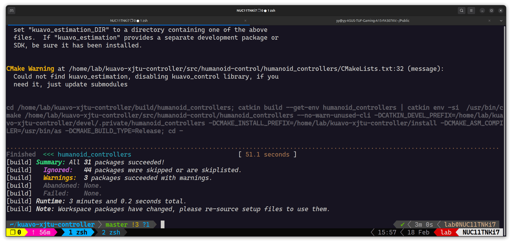

> 这个readme是简化后的只在实机上进行操作，仿真相关的可参考[官方给出的readme](./readme_origin.md)

# 乐聚机器人简易操作手册
## 预配置
**版本确定**：在 `~/.bashrc` 或 `~/.zshrc` 中已经对 `export ROBOT_VERSION=42` 参数进行过配置，无需重复配置

**质量确定**：在机器人出场后会对机器人重新称重，例如我们这台重量为51.7kg，需要将该数字写入到`~/.config/lejuconfig/TotalMassV${ROBOT_VERSION}`文件中，对应修改文件请见这个[commit-b379](https://github.com/wty-yy/kuavo-xjtu-controller/commit/b3797a96b0f3c38e2c7e0f648ebec3a55e8229cb)

**实机代码编译**：将[`ocs2_h12pro_monitor.service`](./src/humanoid-control/h12pro_controller_node/services/ocs2_h12pro_monitor.service)中三个绝对路径改为正确路径，执行下述命令进行编译

```bash
cd kuavo-xjtu-controller # 进入仓库目录
catkin config -DCMAKE_ASM_COMPILER=/usr/bin/as -DCMAKE_BUILD_TYPE=Release # Important! 
# 加载一些已经安装的ROS包依赖环境，包括硬件包等
# bash
source installed/setup.bash
# zsh
source installed/setup.zsh

catkin clean  # 清理之前编译的内容
catkin build humanoid_controllers
```



## MPC控制
### 电机标定

- 将上方红色按钮转开，对电机供电，开机后需要进行一次标定，如下操作：
```bash
sudo su  # 一定要进入管理员su后执行标定
# bash
source devel/setup.bash
# zsh
source devel/setup.zsh
roslaunch humanoid_controllers load_kuavo_real.launch cali:=true cali_arm:=true  # 标定必须包含下身与手臂, 标定完成后按o收腿，再按o站立（需要扶一下），然后就能用手柄控制了
```
- 以下是如果上面那个标定程序退出了，但是上面红色按钮没有关闭过（电机驱动能够记住标定的位置，因此无需再次标定）
```bash
source devel/setup.bash  # 标定好了后，单独进行手柄控制，不加后面参数
roslaunch humanoid_controllers load_kuavo_real.launch 
```

### 手柄控制
> 这部分参考[官方readme中手柄控制的介绍](./readme_origin.md#手柄控制)

> 遥控器型号通过运行时launch参数，joystick_type指定，在`src/humanoid-control/humanoid_controllers/launch/joy`目录指定了按键映射关系，新增遥控器类型可以直接添加自己的按键映射关系到json文件中，运行时通过`joystick_type:=bt2pro`传递相应文件名即可
- joystick_type:=bt2
   使用的手柄型号为"北通阿修罗2无线版"，参考的遥控器键位如下，其他型号需要自行修改遥控器节点：
   - 

   - 右侧按键切换gait
      - A: STANCE 站立状态
      - B: TROT 原地踏步
      - X: JUMP（未启用）
      - Y: WALK（未启用）

   - 摇杆控制腿部运动
      - 左摇杆控制前后左右（左右容易踩到另一个脚，导致控制崩溃）
      - 右摇杆控制左右转，上下蹲（最好不要上下蹲，会导致MPC控制崩溃）
   - start键相当于标定时候按键盘上的o，进入半蹲的姿势，再按o站立，也即从悬挂准备阶段切换到站立
   - back键用于退出所有节点，停止电机位控，机器人立马会软下来，注意要拉着


