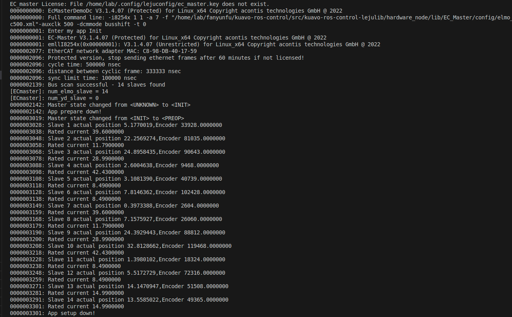
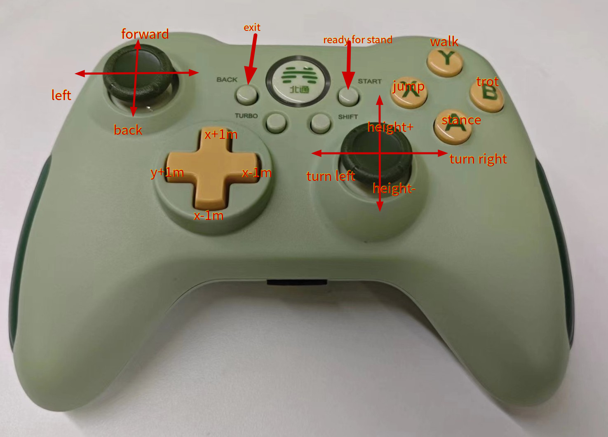
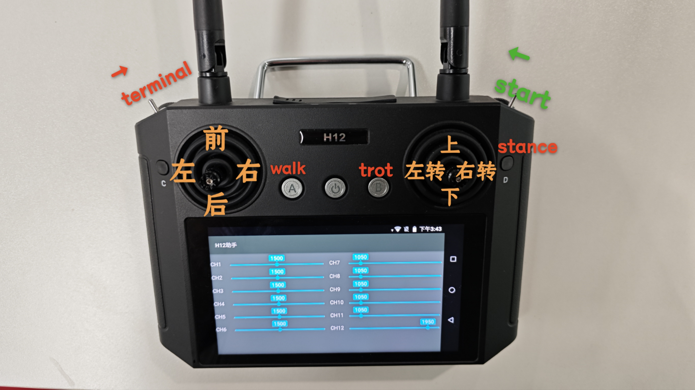

# 如何使用

## 开源仓库
```shell
# https
git clone https://www.lejuhub.com/highlydynamic/craic_code_repo.git

# ssh
git clone ssh://git@www.lejuhub.com:10026/highlydynamic/craic_code_repo.git
```

根据需要选择某个分支(一般稳定一些为beta)
```shell
git checkout dev
```


## 确认机器人版本和总质量
#### 机器人版本
- 机器人版本通过环境变量`$ROBOT_VERSION`设置，版本号涉及不同机器人模型、硬件设置等, 需要和自己的机器人匹配。
- 在终端执行`echo $ROBOT_VERSION`查看当前设置的版本号，如果没有设置，通过以下设置版本号(其中的40代表4.0版本，根据实际情况修改)：

   1. 在当前终端执行(临时设置): 

     `export ROBOT_VERSION=40`

   2. 将其添加到你的 `~/.bashrc` 或者 `~/.zshrc` 终端配置文件中:
    如执行: 

        `echo 'export ROBOT_VERSION=40' >> ~/.bashrc `

    添加到 `~/.bashrc` 文件(bash终端)末尾，重启终端后生效


#### 机器人质量
- 由于每台机器人的选配不同，质量也不同，需要确认机器人的总质量，确保模型准确。(出厂时的质量会修改正确一次)
- 机器人总质量存储于`~/.config/lejuconfig/TotalMassV${ROBOT_VERSION}`文件中(${ROBOT_VERSION}为上述设置的版本号)，编译时会自动读取该文件，校准仓库中的模型质量。
- 机器人称重之后，将总质量写入`~/.config/lejuconfig/TotalMassV${ROBOT_VERSION}`文件中即可。
- ocs2中使用了cppad自动微分库，cppad的缓存与模型相关
  - 因此每次修改总质量文件时，会`自动`删除缓存目录`/var/ocs2/biped_v${ROBOT_VERSION}`, 下一次运行时会自动重新编译cppad模型(大概4分钟)
  - 如果手动修改了仓库中的模型，同样需要删除缓存目录，重新编译cppad模型


## 编译

##### docker环境
在没有机器人运行环境的情况下，可以使用docker环境进行编译和仿真使用。

- docker镜像可以自行根据后续章节使用`./docker/Dockerfile`构建，或者下载已经编译好的镜像：

```bash  
容器下载链接：https://kuavo.lejurobot.com/docker_images/kuavo_opensource_ocs2_mpc_wbc_img_0_3.tar
```

- 执行以下命令导入容器镜像：
```bash
docker load -i kuavo_opensource_ocs2_mpc_wbc_img_0_3.tar
```

- 修改`docker/run.sh`文件中的容器名称和镜像版本：
```bash
CONTAINER_NAME="kuavo_container"   # 修改为你的容器名
IMAGE_NAME="kuavo_opensource_mpc_wbc_img:0.3" # 修改为你的镜像版本
```

- 执行`./docker/run.sh`进入容器后，默认在仓库的映射目录`/root/kuavo_ws`，执行以下命令开始编译：

```bash
catkin config -DCMAKE_ASM_COMPILER=/usr/bin/as -DCMAKE_BUILD_TYPE=Release # Important! 
# -DCMAKE_ASM_COMPILER=/usr/bin/as 为配置了ccache必要操作，否则可能出现找不到编译器的情况
source installed/setup.bash # 加载一些已经安装的ROS包依赖环境，包括硬件包等
catkin build humanoid_controllers #会编译所有依赖项
```

> Note:如果没有安装pinocchio，则需要先安装：
```bash
sudo apt install ros-noetic-pinocchio -y
```

##### 实机环境

- kuavo实机镜像如果较旧，需要手动安装一些依赖项：
```bash
# 提供了一个脚本用于快速在旧的kuavo实机镜像进行安装依赖
./docker/install_env_in_kuavoimg.sh
```

- 实物编译
```bash
cd kuavo-ros-control #仓库目录
catkin config -DCMAKE_ASM_COMPILER=/usr/bin/as -DCMAKE_BUILD_TYPE=Release # Important! 
source installed/setup.bash # 加载一些已经安装的ROS包依赖环境，包括硬件包等
catkin build  humanoid_controllers
```

## 运行

##### 仿真运行

```bash
source devel/setup.bash # 如果使用zsh，则使用source devel/setup.zsh
roslaunch humanoid_controllers load_kuavo_mujoco_sim.launch # 启动控制器、mpc、wbc、mujoco仿真器
```

##### 实物运行
- 实物运行时，开机第一次需要先在cali模式下运行一次，确认机器人姿态和位置正确(机器人所有关节回到零位)

```bash
source devel/setup.bash
roslaunch humanoid_controllers load_kuavo_real.launch cali:=true # 以校准模式启动
```
- 零点标定
   - 机器人的零点是指所有电机在零位置时的位置, 此时机器人姿态处于完全伸直的状态；
   - 零点标定在机器人出厂时会完成一次，除非更换电机或者编码器，其他情况只需要进行`重启之后的实物零点校准`流程即可。
   - 电机的零点存储有两个地方:
      1. 腿部和肩膀两个电机的零点位置存储于`~/.config/lejuconfig/offset.csv`文件中, 每个关节对应一行, 顺序为从躯干出发,左腿、右腿、左肩、右肩的电机;
         - 腿部零点手动标定过程：
            - 将机器人所有关节摆到零位(可以使用工装等硬件设备进行固定)
            - 打开机器人急停按键给机器人电机上电
            - 运行程序（增加cali:=true参数），在使能完腿部电机后(打印出如下图的位置之后), 即可关闭程序(零点校准之前电机运动可能会超出限位)
            - 
            - 其中的`Slave xx actual position 5.1770019`即这个电机的实际位置
            - 将需要标零的电机位置复制到`offset.csv`文件中对应的行中即可, 注意不要有多余的空行
         - 腿部零点辅助标定过程：
            - 将机器人所有关节摆到零位(可以使用工装等硬件设备进行固定)
            - 打开机器人急停按键给机器人电机上电
            - 运行程序（增加**cali_leg:=true**参数）
            - 腿部电机进入使能状态之后，按'c'键，自动保存腿部**当前位置**作为零点
      2. 手臂的零点位置存储于`~/.config/lejuconfig/arms_zero.yaml`文件中,如需微调某个关节可以调整
            - 手臂校准在**root**下执行`rosrun hardware_node setZero.sh`将会以当前手臂位置作为零点并保存到配置文件中;
            - 多圈的情况下手臂后续无需校准, 没有多圈记忆功能的机器**重启之后**需要按下述手臂校准流程校准手臂零点所在圈数
   - **电机的运动方向**：
     - 电机的旋转方向和机器人的坐标系正方向一致，符合右手定则。
     - 机器人正方向：往前->x轴正方向，往左->y轴正方向，往上->z轴正方向。
     - 比如1号髋关节roll轴心与机器人x轴平行，则该电机根据右手定则，绕着机器人x轴旋转的方向即为正方向。
     - 再如：踝关节是由并联杆控制，两个电机轴心与机器人y轴平行(4代)，则该电机根据右手定则，绕着机器人y轴旋转的方向即为正方向。
     - > 注意：膝关节比较特殊，膝关节正方向判断应该看关节的旋转方向而不是看电机的旋转方向(4代上无影响，4pro上的反关节会有差异)
- **重启之后**, 实物零点校准。
   - 在4pro(4.2版本)以下的机器人，没有多圈编码器记忆功能，**每次开机**需要校准各个电机的位置，方式有两种：
   1. 手动校准
      - 开机时手动掰机器人各个关节的电机回到零位所在圈数内，打开机器人急停按键给机器人电机上电
      - 运行程序，机器人进入全身伸直姿态，看所有关节是否都回到零位，如果不在零位处，则单独反方向掰动该关节，关闭再重新打开急停按键，重复运行程序步骤直到所有关节都回到零位
   2. 辅助校准，在`cali:=true`模式下, 提供了一个辅助校准流程：
      - 运行程序，机器人进入全身伸直姿态，看所有关节是否都回到零位
      - 如果需要校准，则根据终端提示输入'c'进入腿部校准模式, 输入'v'进入手部校准模式
      - 校准腿部的模式下：
            1. 输入 'l' 或 'r' 选择要校准的左腿或右腿。
            2. 输入 1-6 选择要校准的电机。
            3. 输入 'w' 增加编码器圈数，输入 's' 减少编码器圈数（注意：电机会移动！）
            4. 输入 'c' 保存校准结果(断电之前都无需重新校准)，输入 'q' 退出校准。
      - 校准手部的模式下：
            1. 输入 'l' 或 'r' 选择要校准的左手或右手。
            2. 输入 2-7 选择要校准的电机(只校准瑞沃关节的电机)。
            3. 输入 'w' 增加编码器圈数，输入 's' 减少编码器圈数（注意：电机会移动！）
            4. 输入 'd' 将手臂电机掉使能(此时可以掰动手臂电机), 输入 'e' 重新使能
            5. 输入 'f' 以当前手臂位置作为零点并保存
            6. 输入 'c' 保存校准结果(断电之前都无需重新校准)，输入 'q' 退出校准。
      
      - 根据需要通过上述按键组合逐圈调整电机, 直到所有关节都回到零位所在圈。
      - > 注意：按`w`和`s`键时，请仔细确认运动方向正确，不要反方向调节，否则会触发电机的限位保护，程序退出。
   3. 手臂的位置需求不那么准确时，可以通过`cali`模式下再传入一个`cali_arm=true`，将会以当前位置作为手臂的零点，并保存到配置文件中。
> 注意：没有多圈编码器记忆功能的版本，电机断电之后，开机都需要手动校准一次;腿部的辅助校准功能只用于关机重启之后**校准编码器圈数**, 即需要确认此前的腿部零点是正常的, 否则请先手动校准一次。
  
- 之后直接按`o`启动机器人，后续运行正常运行即可
```bash
source devel/setup.bash
roslaunch humanoid_controllers load_kuavo_real.launch 
```
- 运行程序之后，机器人会进入待站立阶段，确认无误之后，准备扶住机器人，然后按`o`启动机器人，机器人回开始运动到站立状态，并开启反馈控制。


## 手柄控制
> 遥控器型号通过运行时launch参数，joystick_type指定，在`src/humanoid-control/humanoid_controllers/launch/joy`目录指定了按键映射关系，新增遥控器类型可以直接添加自己的按键映射关系到json文件中，运行时通过`joystick_type:=bt2pro`传递相应文件名即可
- joystick_type:=bt2
   使用的手柄型号为"北通阿修罗2无线版"，参考的遥控器键位如下，其他型号需要自行修改遥控器节点：
   - 

   - 字母键切换gait
      - A: STANCE
      - B: TROT
      - X: JUMP
      - Y: WALK

   - 摇杆控制腿部运动
      - 左摇杆控制前后左右
      - 右摇杆控制左右转和上下蹲
   - 按钮发送固定target
   - start键实物控制时用于从悬挂准备阶段切换到站立
   - back键用于退出所有节点
- joystick_type:=h12
   使用的手柄型号为"H12pro"，参考的遥控器键位如下
   - 
   - 摇杆控制腿部运动
      - 左摇杆控制前后左右
      - 右摇杆控制左右转和上下蹲
   - 实物start开关掰到最中间位置可以结束悬挂准备阶段，进入站立状态
   - 左侧开关掰到最中间终止程序

`HumanoidAutoGaitJoyCommandNodeVel`节点(默认)
- 发送/cmd_vel消息给MPC
- 摇杆往前推，自动切换到walk行走，到达target之后自动停止
- 按钮发送固定target也会自动切换walk行走，自动停止
- 在stance状态时手动切换gait之后，会变成手动模式，通过摇杆可以控制运动，不会自动停止，直到重新切换回stance

`HumanoidJoyCommandNode`节点
- 没有自动切换gait的遥控器节点


> note: 手柄控制实物的`load_kuavo_real.launch`默认打开手柄控制，插上手柄接收器即可使用，仿真的launch文件，需要传入`use_joystick:=true`参数开启

## QUEST3 VR控制
- 按照前面的步骤正常启动机器人
  

- 启动VR节点
   - 运行
  
  > 旧版镜像如果没有包含VR相关依赖，需要手动安装：`cd src/manipulation_nodes/noitom_hi5_hand_udp_python && pip install -r requirements.txt && cd -`
  
  ```bash
   source devel/setup.bash

   # VR先和机器人连到同一局域网，查看VR里面的ip地址记下来
   # 然后在机器人上运行以下命令，ip_address输入quest3的ip地址，
   roslaunch noitom_hi5_hand_udp_python launch_quest3_ik.launch ip_address:=192.168.3.32
  ```
  > 如果希望同时映射躯干的运动（上下蹲和弯腰），可以增加选项`control_torso:=1`，使用前**务必在站立状态下长按VR右手柄的meta键**以标定躯干高度。

  > 默认控制双手，如果需要控制单手，可以增加选项`ctrl_arm_idx:=0`, 其中0，1，2分别对应左手，右手，双手
- 全程使用VR的手柄控制即可
  - 启动时按A键站立(从启动等待开始状态站立，相当于kuavo中的按o)；
  - 停止机器人，同时按下左侧XY两个键，停止机器人
  - 自动模式下，推摇杆即走，松摇杆自动立即停止
  - 按下A（stance）、B（walk）也可以手动切换gait
  - 扳机控制手指开合，Y键用于锁定或解锁手指控制
  - 默认摇杆左摇杆控制前后，右摇杆控制左右转；
    - 当手放到一侧的两个按钮上时(只接触不按下)，切换为对侧为控制左右或者高度
    - 如手指覆盖住左侧的XY键，则右侧摇杆切换为高度控制
    - 手贴在左侧XY键，右侧摇杆会自然地变为高度控制，按下去即可关闭程序；
  - x键为模式切换辅助键，按住x键之后,其他按键的作用如下：
    - A:手臂模式切换为外部控制/自动摆手，这两种模式切换之后会有一个平滑同步到当前规划轨迹的过程
    - B:手臂模式切换为保持姿态
 
 ## 键盘控制
 - 如没有手柄或者VR等，可以使用键盘控制节点进行控制, 如运行仿真器并且使用键盘控制节点
 
 ```bash
 source devel/setup.bash   
 roslaunch humanoid_controllers load_kuavo_mujoco_sim.launch joystick_type:=sim 
 ```
 - 运行后将会启动仿真，并且在另外一个终端窗口打开键盘控制窗口，按键控制机器人运动，具体按键如下：
```
WASD: Left stick, control forward/backward, left/right
IKJL/QE: Right stick, up/down, turn left/right
R: walk, C: stance, T: trot
B: BUTTON_BACK, O/F: BUTTON_START
<space>: Reset all axes to zero
Press Ctrl-C to exit
```
- 键盘控制节点也单独可以手动开启，可以运行多个
```bash
source devel/setup.bash
rosrun humanoid_interface_ros joystickSimulator.py 
```

# 各个node和topic的介绍

[readme.topics.md](./docs/readme.topics.md)

# Build docker image&container for Kuavo-MPC-WBC
## 1. Install Docker
Follow the instructions on the official Docker website to install Docker on your system. 
## 2. Build docker imags with a dockerfile
We provide a dockerfile for Kuavo-MPC-WBC. You can use it to build a docker image for Kuavo-MPC-WBC. You just need to run the following command, which will build the docker image `kuavo_mpc_wbc_img:0.3` from the `./docker/Dockerfile`.
```bash
./docker/build.sh
``` 

# run docker container
## 1. Run docker container
You can run a docker container with the following command:
```bash
docker run -it --net host  --name kuavo_container  --privileged  -v /dev:/dev  -v "${HOME}/.ros:/root/.ros"  -v "./.ccache:/root/.ccache"  -v "./:/root/kuavo_ws"  -v "${HOME}/.config/lejuconfig:/root/.config/lejuconfig"  --group-add=dialout  --ulimit rtprio=99  --cap-add=sys_nice  -e DISPLAY=$DISPLAY  --volume="/tmp/.X11-unix:/tmp/.X11-unix:rw"  kuavo_mpc_wbc_img:0.3  bash
```

## 2. for GPU Version
If you want to use GPU version of Kuavo-MPC-WBC, you just need to add the `--gpus all` command to the `docker run` command.

## 3. we provide a script to run the docker container
You can run the docker container with the following command:
```bash
./docker/run.sh
```
> This script will automatically find the exisiting container and restart it, or create a new container if it does not exist, and run the container with the correct parameters. 


