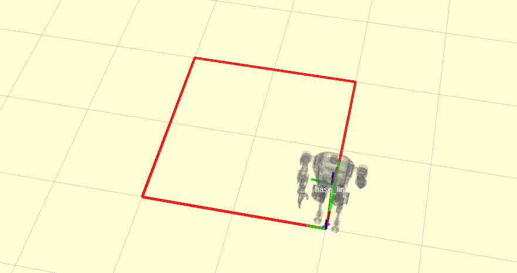
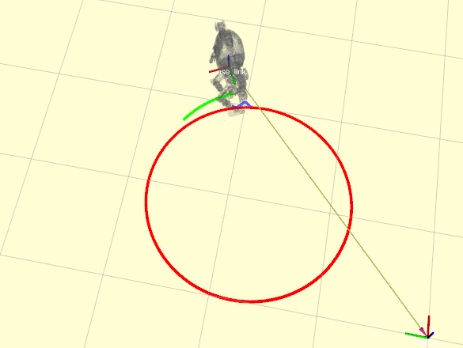
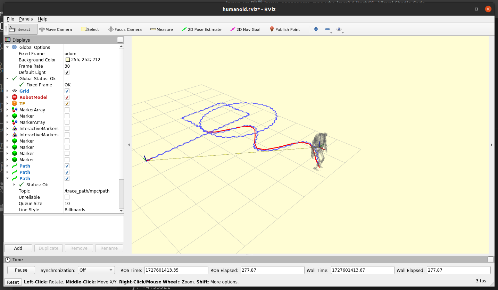
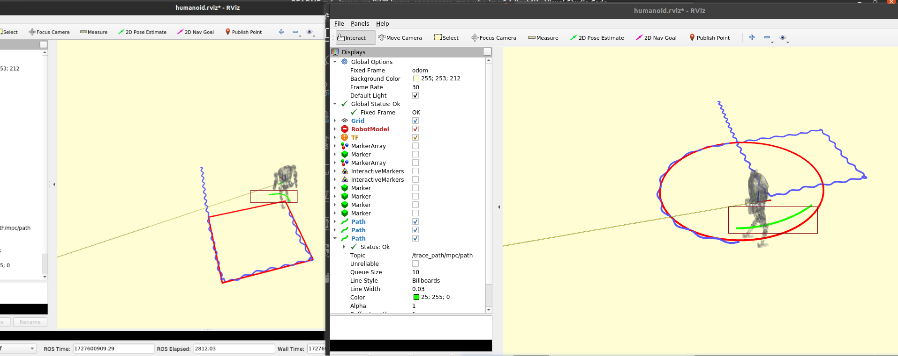

# Demo - Tracing Path

## 描述

使用 MPC 控制器跟踪给定的固定轨迹示例，包括:
- 直线：从机器人当前的位置和朝向为起点，生成指定长度的轨迹
- 正方形：从机器人当前的位置和朝向为起点，逆时针生成指定长度的轨迹
- 圆形：从机器人当前的位置和朝向为起点，逆时针生成指定半径的轨迹
- “S” 曲线：从机器人当前的位置和朝向为起点，生成正弦曲线轨迹

## 目录结构
```bash
# tree -L 2 -d
.
├── CMakeLists.txt
├── docs      # 文档/图片
├── include 
│   └── trace_path  # 头文件
├── launch        
│   ├── follow_circle_traj.launch  # 跟踪圆形轨迹-启动文件
│   ├── follow_s_curve_traj.launch # 跟踪S曲线轨迹-启动文件
│   └── follow_sqaure_traj.launch  # 跟踪正方形轨迹-启动文件
├── package.xml
├── README.md
├── rviz
│   └── trace_path_demo.rviz
└── src
    ├── circle_path_generator.cpp   # 圆形路径生成器
    ├── common                      # 公共方法
    ├── line_path_generator.cpp     # 直线路径生成器
    ├── mpc_path_tracer.cpp         # MPC 控制器
    ├── path_tracer.cpp             # 路径跟踪器基类
    ├── pid_path_tracer.cpp
    ├── s_curve_path_generator.cpp  # 正方形路径生成器
    ├── square_path_generator.cpp   # S曲线路径生成器
    └── tests                       # *_main.cc 入口
```

## 参数设置
### 路径参数
公共参数：
- speed: 速度，单位 m/s
- dt: 时间间隔，单位 s
即每隔`speed * dt`距离在路径上生成一个点
#### 直线
- length: 长度，单位 m
#### 正方形
- side_length： 边长 ，单位 m
#### 圆形
- radius: 半径，单位 m
#### S 曲线
- length: 总长度的一半，单位 m
- amplitude： 振幅

| 正方形路径 | 圆形路径|S曲线路径 |
| -- | -- | -- |
||||

### 控制器

### ~~PID~~ 

#### MPC 
可通过`set_max_linear_velocity`和`set_max_angular_velocity`设置最大线性速度和最大角速度来约束求解

## 编译
修改 `src/demo/trace_path/src/tests/*_main.cc` 对应文件的的路径参数和控制器参数，然后编译运行：
```bash
cd ~/kuavo_ws
catkin build trace_path # 编译
```

## 启动
**终端1**：启动机器人程序

若不熟悉如何启动 OCS2 机器人, 请阅读 [OCS2 机器人使用文档](../../../readme.md).

```bash
source devel/setup.bash # 如果使用zsh，则使用source devel/setup.zsh
# 仿真环境运行
roslaunch humanoid_controllers load_kuavo_mujoco_sim.launch # 启动控制器、mpc、wbc、仿真器
# 实物请运行
roslaunch humanoid_controllers load_kuavo_real.launch # 启动实物节点
```

**终端2**：生成轨迹并跟踪

启动参数:
- `rviz` 可视化参考路径和实时路径(可选): `rviz:=true`

```bash
source devel/setup.bash

# 正方形轨迹跟踪
roslaunch trace_path follow_sqaure_traj.launch

# 圆形轨迹跟踪
roslaunch trace_path follow_circle_traj.launch

# S曲线轨迹跟踪
roslaunch trace_path follow_s_curve_traj.launch
```

## 关键话题

- 获取机器人在世界坐标系的位置
  
- 获取当前位置设置为起点，生成`nav_msgs/Path`格式的路径轨迹
  
- 通过向机器人订阅的`/cmd_vel`话题发送消息命令，控制其运动
  
- 如何通过 PID/MPC 控制调整机器人沿着路径轨迹运动
  

### 获取机器人位置信息

话题：`/odom`
消息：`nav_msgs/Odometry`  
 
### 控制机器运动

话题：`/cmd_vel`

消息：`geometry_msgs/Twist`

```bash
rostopic pub /cmd_vel geometry_msgs/Twist "linear:
  x: 0.1
  y: 0.0
  z: 0.0
angular:
  x: 0
  y: 0.0
  z: 0.0" -r 1000
```
### 路径表示

消息：`nav_msgs/Path`

```bash
show nav_msgs/Path
std_msgs/Header header
  uint32 seq
  time stamp
  string frame_id
geometry_msgs/PoseStamped[] poses
  std_msgs/Header header
    uint32 seq
    time stamp
    string frame_id
  geometry_msgs/Pose pose
    geometry_msgs/Point position
      float64 x
      float64 y
      float64 z
    geometry_msgs/Quaternion orientation
      float64 x
      float64 y
      float64 z
      float64 w
```
## 发布话题
- `trace_path/path` : 跟踪的给定固定路径（正方形，圆形，S 曲线...）
- `trace_path/realtime_path` : 机器人实时运动轨迹
- `trace_path/mpc/path` : MPC 控制器求解的局部路径

## 效果预览
#### PID 
说明：
- 路径：直线-正方形-圆形-S曲线

#### MPC
说明：
- 红色路径为给定的固定轨迹
- 蓝色路径为机器人的行走产生的跟踪轨迹
- 绿色为 MPC 求解的局部轨迹

