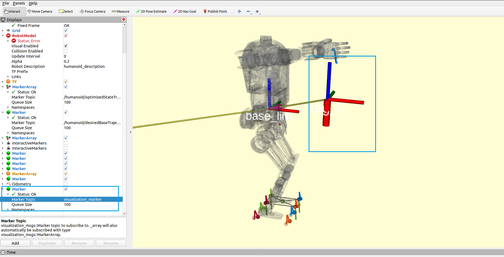

# humanoid_arm_control

本案例基于视觉识别 apriltag ，控制手臂抓取对应的物体。同时。本案例还包含了其他一些示例如下：
- 通过按键控制手臂末端移动
- 运行固定的抓取轨迹

## 依赖
```bash
sudo apt install ros-noetic-apriltag-ros
python3 -m pip install numpy-quaternion # and more..
```

## 编译
```bash
catkin build humanoid_arm_control 
```
## 配置文件说明
配置文件在目录`config/`下，其中：
- `armcontrol_config.json` 配置了 IK 使用到的 URDF 模型，
- `armservice_config.json` 为本案例服务的配置文件，主要内容如下:
   - `preset_action_path`: 预设抓取动作路径，
   -  `tag_id`: 识别 tag 的 id
   - `target_offsets`: **可微调整与 tag 位置的 xyz 偏移量来控制抓取点。**

## 运行
### 配置 ROS 主从机参数
查看下位机躯干NUC 的 IP 地址：
```bash
ip addr
2: enp4s0: <BROADCAST,MULTICAST,UP,LOWER_UP> mtu 1500 qdisc fq_codel state UP group default qlen 1000
    link/ether 10:7c:61:76:a2:14 brd ff:ff:ff:ff:ff:ff
    inet 192.168.3.15/24 brd 192.168.3.255 scope global dynamic noprefixroute enp4s0
       valid_lft 6144sec preferred_lft 6144sec
    inet6 fe80::3d06:3f9f:e1c6:da42/64 scope link noprefixroute 
       valid_lft forever preferred_lft forever

```
编辑下位机`~/.bashrc`文件，添加如下内容：
```bash
export ROS_MASTER_URI=http://<IP>:11311  # export ROS_MASTER_URI=http://192.168.3.15:11311 
```
编辑上位机`~/.bashrc`文件，添加如下内容：
```bash
export ROS_MASTER_URI=http://<下位机IP>:11311  # export ROS_MASTER_URI=http://192.168.3.15:11311 
```
下位机启动 ROS:
```bash
pkill ros
source ~/.bashrc
roscore &
```

### 上位机启动 apriltag 检测节点
关于此步骤可详细阅读[相机功能包文档](https://www.lejuhub.com/ros-application-team/kuavo_ros_application/-/blob/dev/docs/%E8%A7%A3%E6%9E%90dynamic_biped%E5%8A%9F%E8%83%BD%E5%8C%85.md)和[视觉基础使用文档](https://www.lejuhub.com/ros-application-team/kuavo_ros_application/-/blob/dev/docs/How_to_use_demo/02_%E5%9F%BA%E7%A1%80%E8%A7%86%E8%A7%89%E4%BD%BF%E7%94%A8%E6%89%8B%E5%86%8C.md)。

```bash
git clone https://www.lejuhub.com/ros-application-team/kuavo_ros_application.git
git checkout dev
catkin build

# 启动节点
source devel/setup.bash 
roslaunch dynamic_biped sensor_robot_enable.launch
```

### 启动 humanoid_controllers 节点
 humanoid_controllers 节点编译和启动可阅读本仓库 [README 文档](../../../readme.md)，在此不作赘述。
```bash
source devel/setup.bash # 如果使用zsh，则使用source devel/setup.zsh
# 仿真环境
roslaunch humanoid_controllers load_normal_controller_mujoco_nodelet.launch # 启动仿真器
# 实物运行
roslaunch humanoid_controllers load_kuavo_real.launch # 启动实物节点
```

### 启动本服务节点
```bash
source devel/setup.bash
rosrun humanoid_arm_control ArmService_flask.py
```
等待客户端请求服务接口。

## ROS 服务接口

**/arm_control**
```bash
rosservice info /arm_control
Node: /arm_service
URI: rosrpc://ohh-lejurobot:39837
Type: humanoid_arm_control/armControl
Args: req tagid
```
参数说明：
- req: 请求类型，目前支持：0-识别抓取，1-运行左手固定位置抓取轨迹，2-运行右手固定位置抓取轨迹
- tagid: apriltag id

## 调试

### tag 信息 mock 工具
该工具提供了 apriltag 信息模拟发布功能，您可以修改脚本中 tag 的信息，然后运行脚本即可 mock。该工具主要用于在无需启动相机的
情况下，方便调试。
```bash
source devel/setup.bash
rosrun humanoid_arm_control mock_tag_publisher.py
```
如下图，执行该脚本后，可在 RVIZ 中查看到 tag的位置和对应的 marker。



### 抓取服务请求示例
执行该脚本，机器人会根据识别到的 apriltag 信息进行抓取。
```bash
source devel/setup.bash
rosrun humanoid_arm_control client_test.py
```

### 左手固定抓取轨迹
执行该脚本，机器人会执行左手固定的抓取轨迹。
```bash
source devel/setup.bash
rosrun client_test_left_fixed_traj.py
```

### 右手固定抓取轨迹
执行该脚本，机器人会执行右手固定的抓取轨迹。
```bash
source devel/setup.bash
rosrun client_test_right_fixed_traj.py
```

## 其他

### 按键控制手臂示例
详细内容请阅读[说明文档](docs/arm-control-keyboard.md)。
```bash
source devel/setup.bash
rosrun humanoid_arm_control arm_control_with_keyboard.py
# output：
# ..... 
# -------- 按键控制手臂运动：
#  ws: 控制 x 轴
#  ad: 控制 y 轴
#  qe: 控制 z 轴
#  按 Ctrl-C 退出
``` 

### 手臂控制轨迹示例
```bash
source devel/setup.bash
rosrun humanoid_arm_control run_fix_trajectory_keyboard.py

# output：
# .....
# [WARN] [1730190936.211059]: ------------------------------------------
# [WARN] [1730190936.215381]: 按 '1' 键执行固定轨迹 1
# [WARN] [1730190936.220309]: 按 '2' 键执行固定轨迹 2
# [WARN] [1730190936.222282]: 按 '3' 键执行固定轨迹 3
# [WARN] [1730190936.224592]: 按 'esc' 键退出程序
# [WARN] [1730190936.226502]: ------------------------------------------
```
