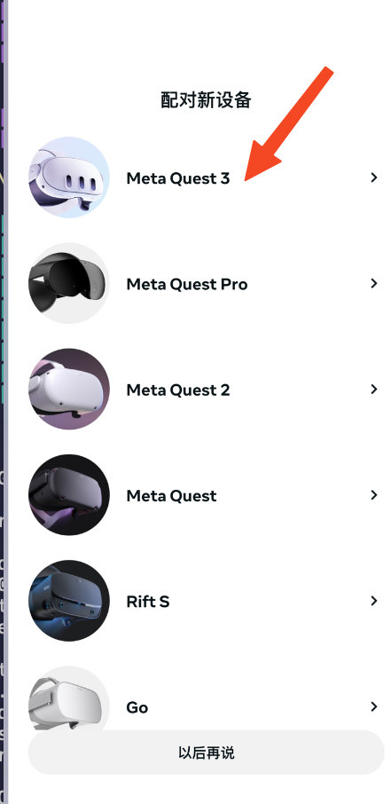
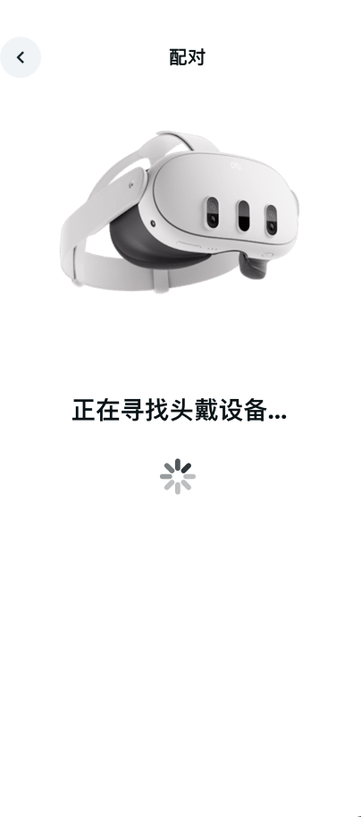
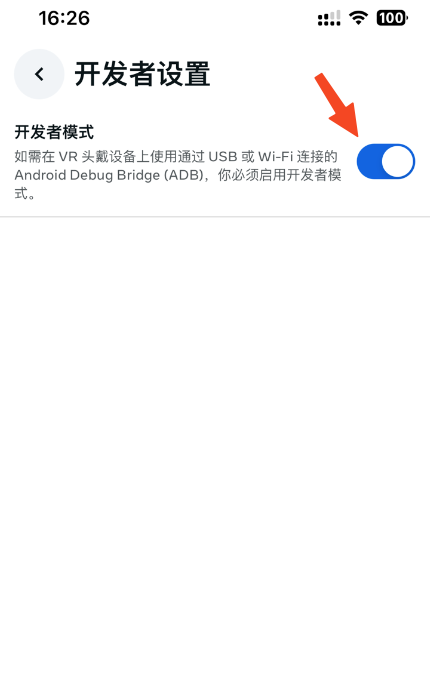

# 激活

1. 需要有一台可以直连 meta 的服务器的路由器。（你懂的）

2. Quest3 开机，并通过 wifi 连结路由器

3. 一般一开始系统都会自动升级。需要等待升级完成。如果没有连接可以直连 meta 的路由器，那么这一步可能会失败，后续步骤无法进行。

4. 升级生成之后会进入绑定操作

    4.1 一个 meta 的开发者账号，可以自行注册并绑定相关信息
    
    4.2 在手机上安装 Meta Horizon ，这一步可能需要使用中国区以外的 apple store 或者 google play 来下载。
    
    4.3 安装完之后启动程序会需要登录账号，使用 meta 开发者账号登录
    
    4.4 在软件中绑定设备
    
    
     
     
     
     
     
     
     

5. 绑定完成之后需要开启开发者选项才能安装程序。注意，这里需要是使用 meta 开发者账号登录之后开发者选项才能生效

    
    
    

# 安装程序

1. 需要有 adb , 可以搜索下载 android studio 并安装 android sdk 来安装
2. 安装完成之后，用 typeC 线连接 Quest3，此时 Quest3 会弹出提示是否信任当前的电脑，选择永久信任即可
3. 使用 adb xxx.apk 对程序进行安装。有些环境可能会在安装之后出现 INSTALL_FAILED_INVALID_URI 的提示。此时可以到头盔里里面找一下已安装的程序，如果有对应的程序并且可以打开，就说明安装成功。
